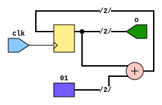
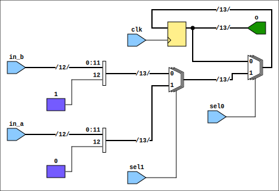

# FIT_PM_GW_CPLD

## Simulation
Modules simulated using `GHDL`.
Use `make <testbench>` to run simulatoin and to view the results in `gtkwave`. Available testbenches:
* cnt2_tb
* mux_latch_tb
* ampl_logic_tb
* ampl_top_tb

## `cnt2` module description

## `mux_latch` module description

## `ampl_logic` module description

## `ampl_top` module description
