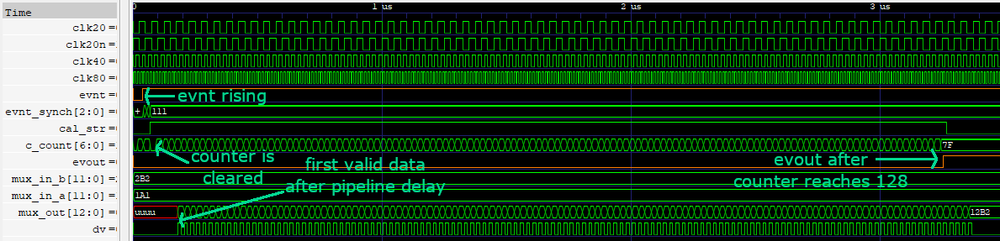
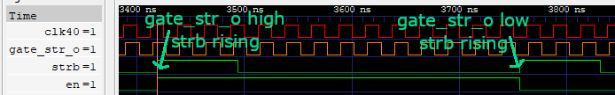
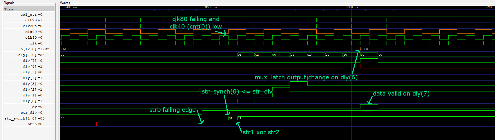

# FIT_PM_GW_CPLD

## Simulation
Modules simulated using `GHDL`.
Use `make <testbench>` to run simulatoin and to view the results in `gtkwave`. Available testbenches:
* cnt2_tb
* mux_latch_tb
* ampl_logic_tb
* ampl_top_tb

## `cnt2` module description
Output signals are clock-type signals with frequency(clk)/2 and frequency(clk)/4 where clk has 80 MHz. Which are:
* 40 MHz signal for gate circuit for strobe signal which comes out from CFD (Constant fraction discriminator)
* 20 MHz signal as a trigger for integrators
\

## `mux_latch` module description
Output value is switched between two input values which are outputs of two integrators. `dly_6` signal is a strobe singal delayed by 6 clk cycles due to ADC pipeline delay. `cnt(1)` is a 20 MHz trigger signal for integrators.
`in_a` is propagated to output in case strobe signal comes when `cnt(1)` is low and `in_b` when high.

## `ampl_logic` module description
There are two ways in which the module can be activated: using event or using strobe signal.\
`evnt` is signal generated form previous module in chain as `evout`. When event is triggered 7-bit counter is cleared and counts up to 127. The counter is incremented with every cycle of 40 MHz clock. Output data comes alternately from both integrators, each measurement is marked with `dv` data valid signal.
\
`en` signal comes form external D flip-flop which data input is `gate_str_o` and it's clock is `strb` which comes out from CFD (Constant fraction discriminator). `gate_str_o` is `clk40` delayed by 2 ns.
\
